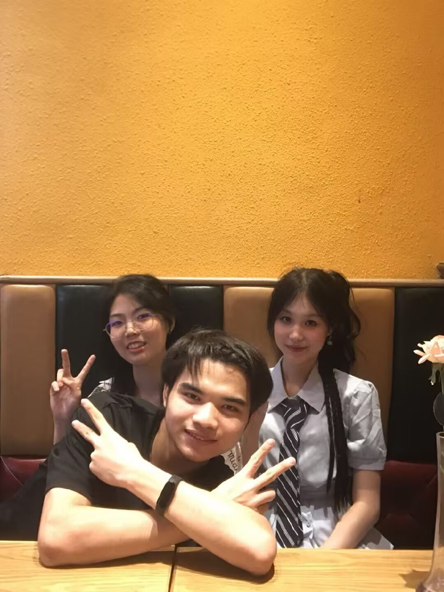
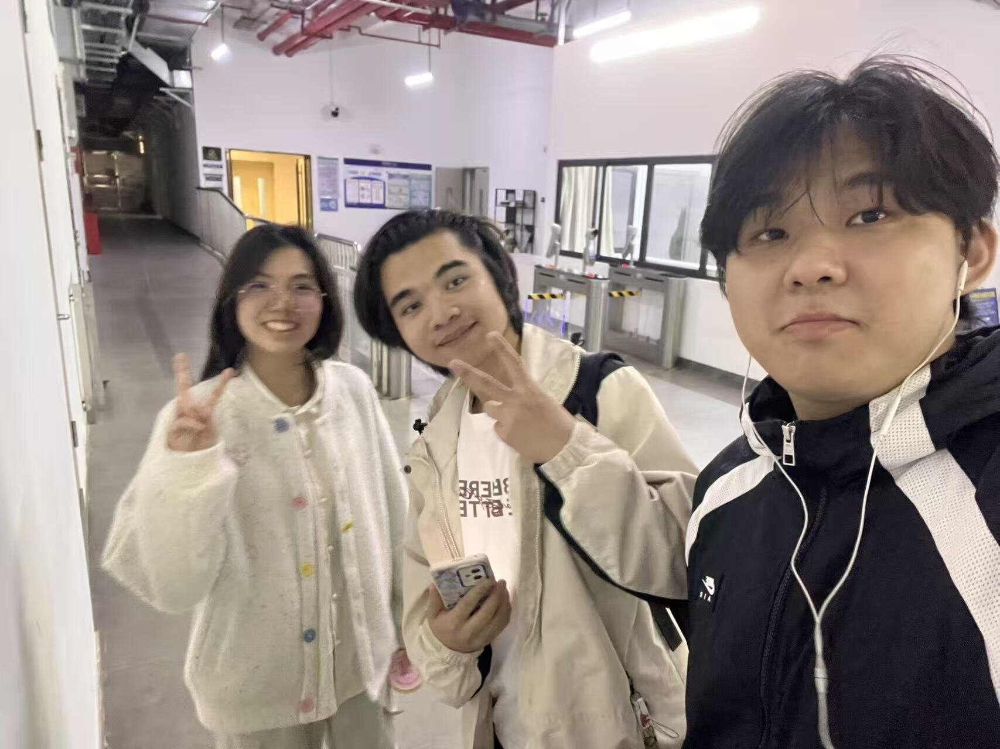
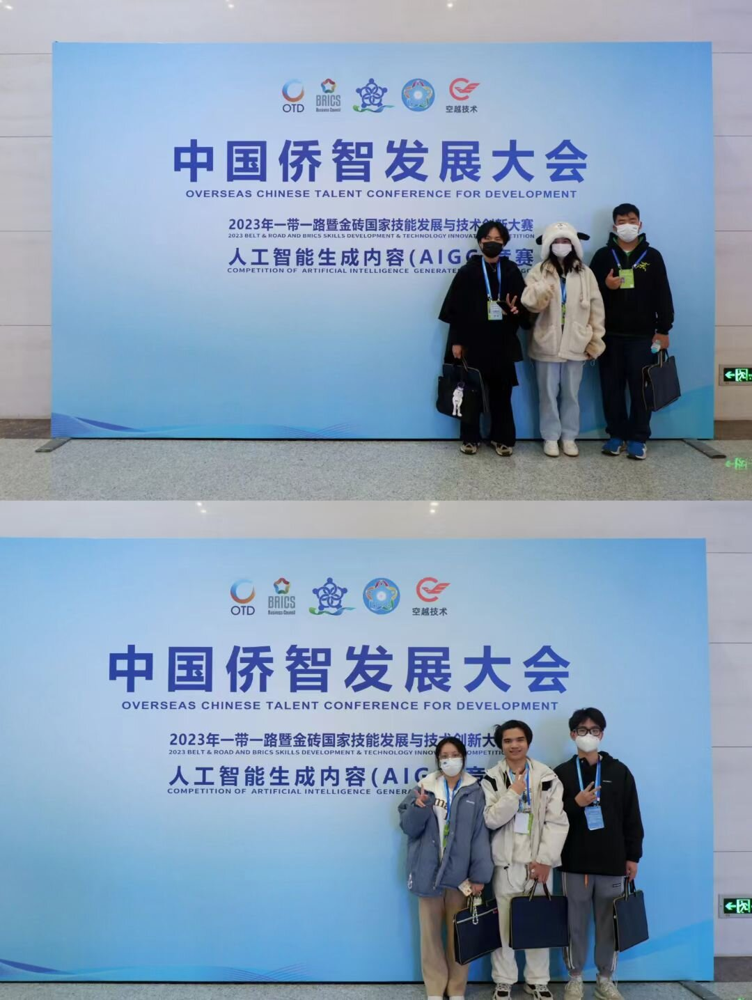
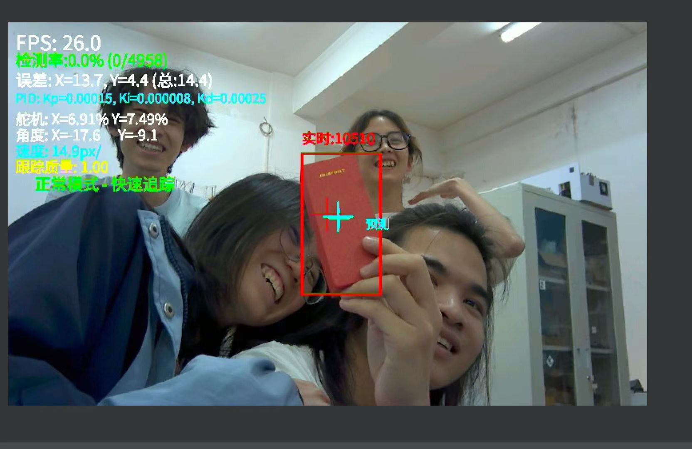
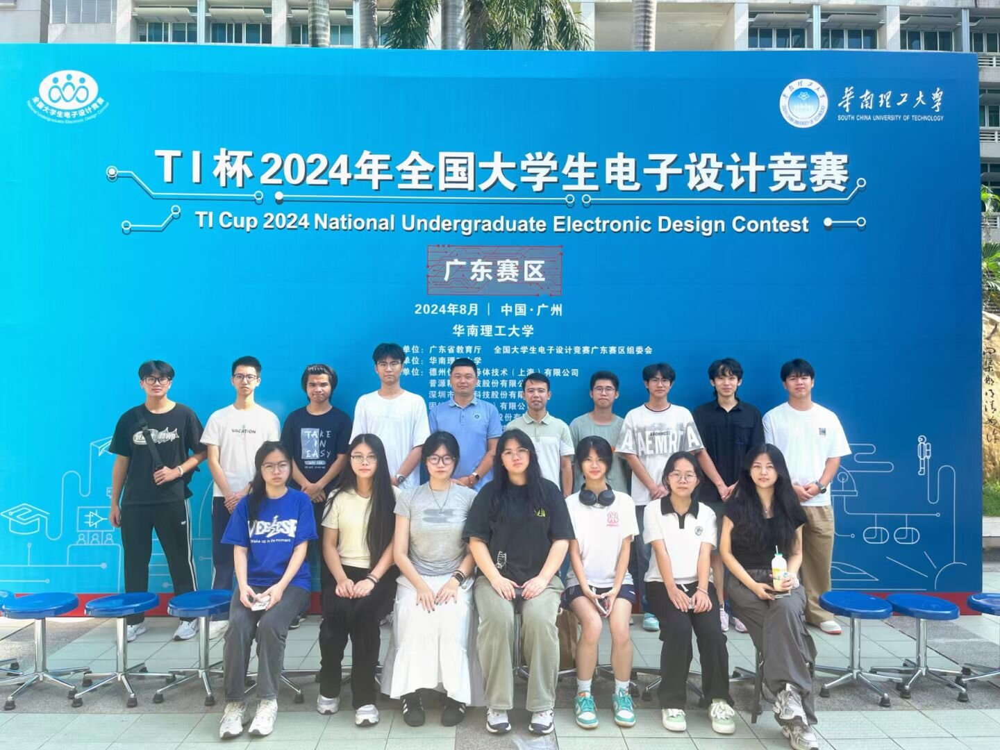
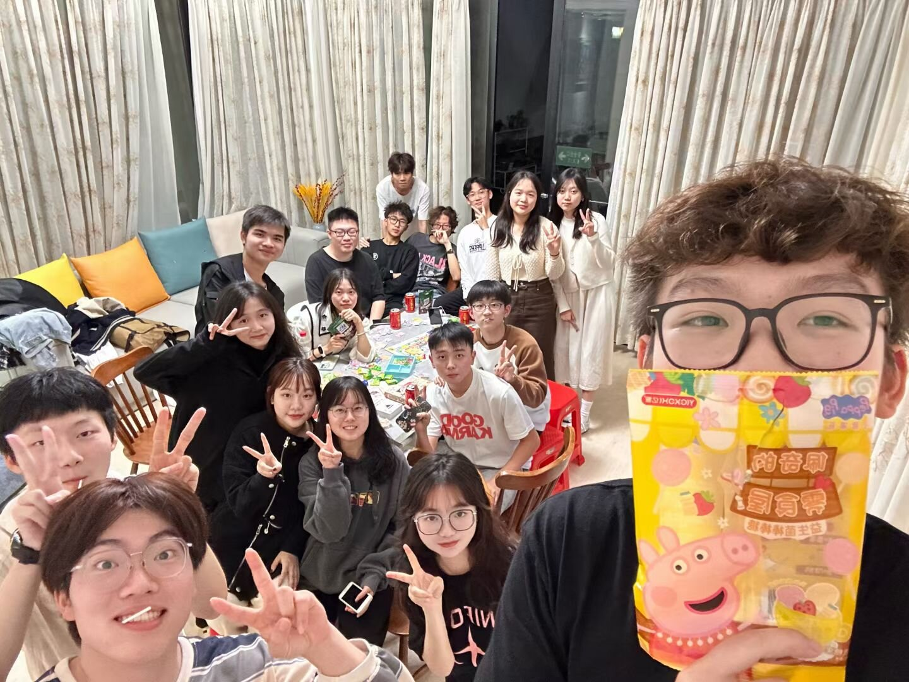
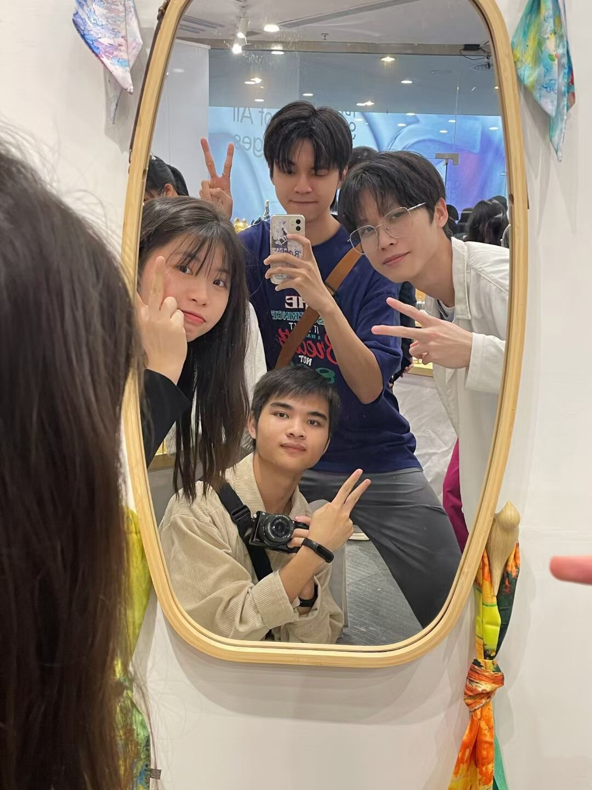

# 差一点忘记了自己的生日

大学那几年过得很忙，没留下多少照片，也没有认识特别多的人。

但现在回头看，遇到的每一个人都很重要。相册里留下来的那些合照，可能拍得并不讲究，有些甚至已经记不清前后发生了什么，可只要再看一眼，当时的教室、实验室和聚餐时的热闹，好像又能慢慢想起来。

## 被工作挤过去的一天

今年的生日过得有些荒唐。

早上看到父亲发来的“生日快乐”，我的第一反应居然是：他们是不是记错日子了？

然后照常上班，照常忙手里的事情。一天就这样被工作填满，没有蛋糕，也没有专门安排去哪里玩。等晚上加完班，走在回家的路上，时间已经到了十一点四十分。母亲问我：“今天生日，去哪里玩了？”

我愣了一下，这才想起来，原来真的是今天。

世界上很悲伤的事情大概就是这样：生日当天，家里人都记得，自己却忙忘了。

离零点只剩下二十分钟，我赶紧从相册里翻出几张照片，想凑一条朋友圈，至少给这一天留点什么。照片还没选好，文字也没想明白，生日已经过去了。

唉，又老一岁咯。

## 相册里不算遥远的大学

找照片的时候，顺便翻到了大学时期留下的一些画面。

有人一起参加活动，有人在实验室里折腾东西，也有很多人围在一张桌子旁吃饭。以前总觉得这些场景很普通，聚完就散了，比赛结束也就结束了。现在再看，才发现当时愿意一起做事、一起拍照的人，本身就是那段时间里很珍贵的部分。

大学很忙这句话并不完全是抱怨。忙着上课，忙着做项目，也忙着参加比赛。许多时候只想着赶紧把眼前的问题解决，很少意识到那些平常的日子以后会变成回忆。

照片替我留下了一些当时没有认真记录的东西。画面里的大家挤在一起，对着镜头笑，背后可能还有没做完的任务，也可能刚刚结束一段忙碌。具体发生过什么，时间久了难免会模糊，但看到那些熟悉的脸，还是会想起自己曾经和一群人认真地做过一些事情。

我没有在大学认识很多人，也算不上擅长维持热闹的人际关系。可数量好像没那么重要。真正留在记忆里的，从来不是通讯录有多长，而是在某一段具体的日子里，有谁和自己并肩站过。

## 又长大一岁

今年没有认真过生日，甚至差一点错过了它。可在最后那二十分钟里翻相册，也意外把过去重新看了一遍。

父母记得我的生日，旧照片替我记得大学，而我直到一天快结束时，才终于记起应该停下来看看自己。

生日并没有因为错过零点就失去意义。它只是提醒我，工作再忙，日子也不该只剩下待办事项。那些关心我的人、曾经一起走过一段路的人，还有如今正在努力生活的自己，都值得被认真记住。

下一次，希望不要再等到晚上十一点四十分，才发现这一天原来属于自己。
