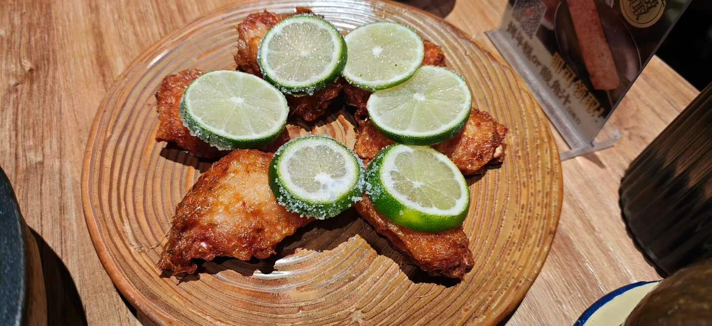
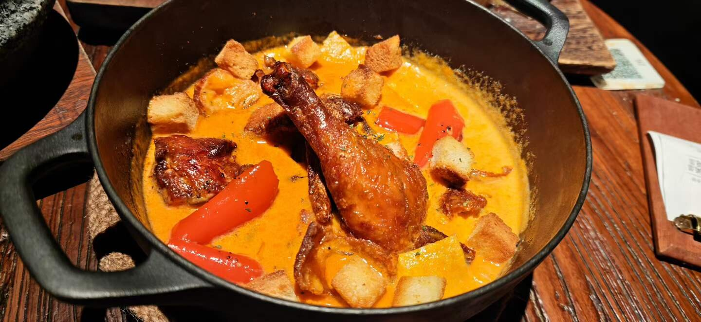
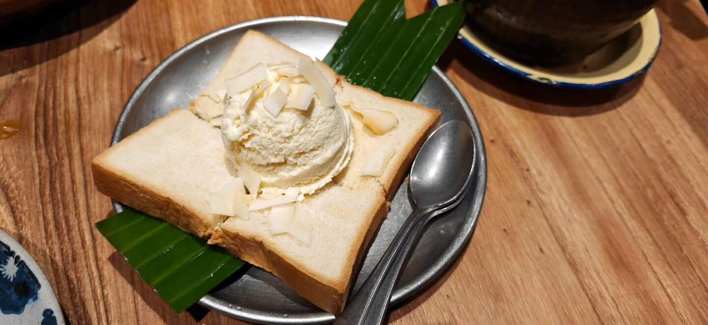
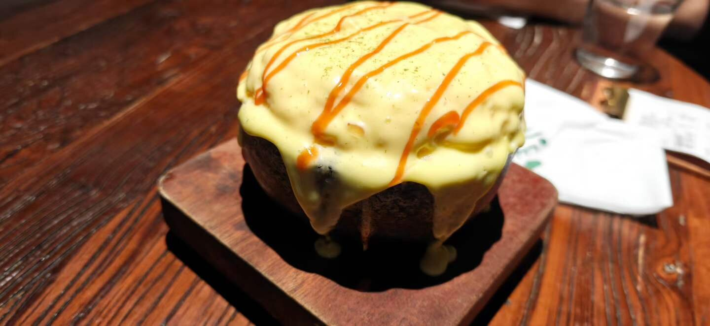
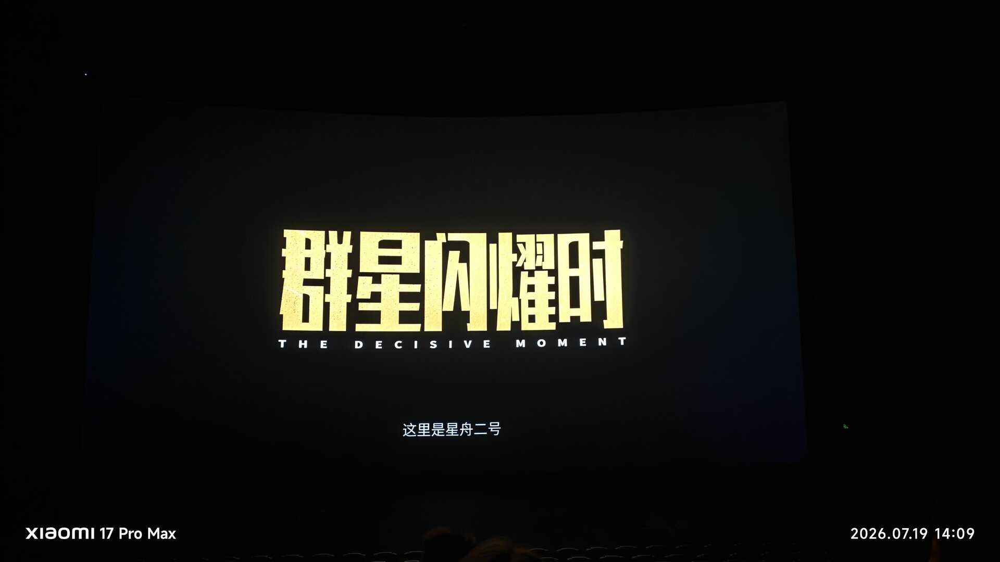
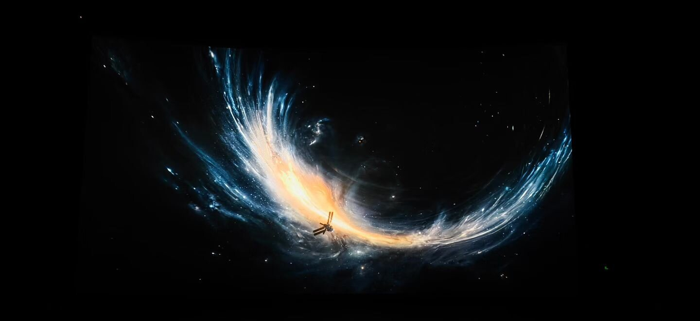
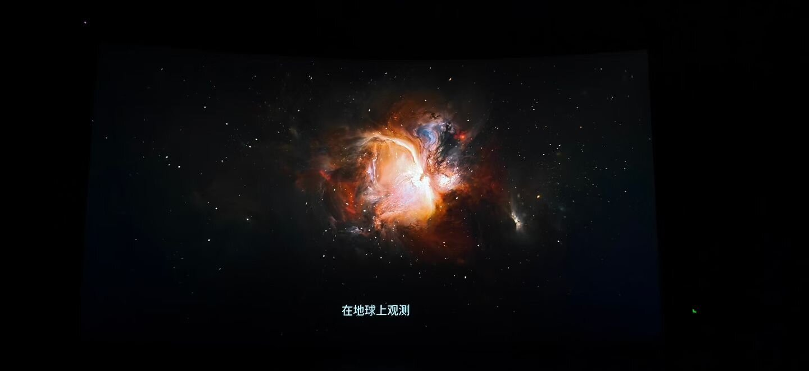
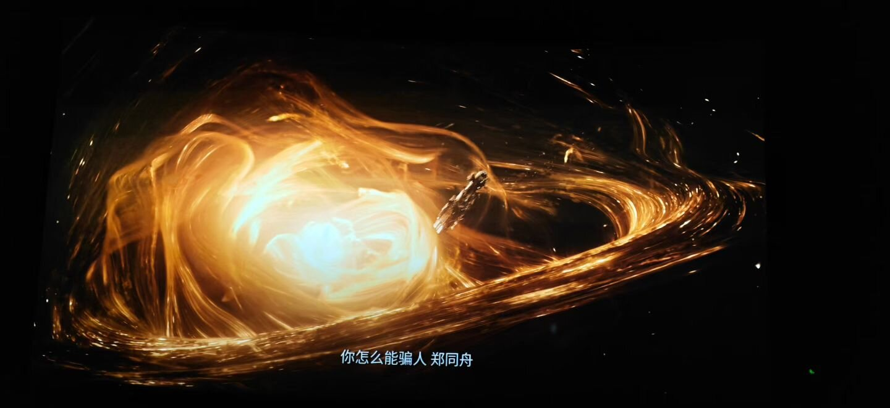

# 在深圳，补过一个属于自己的生日

人在工作压力大的时候，好像总会产生一点报复性消费的冲动。平时舍不得买的东西突然想买，平时觉得没必要去的地方也想去看看，像是要用花出去的钱和短暂的快乐，把积攒下来的疲惫换走一点。

初来深圳，我大部分时间都被人流和工作裹挟着向前。每天跟着大家通勤、上班、回家，还没有真正停下来看看这座城市，也没有好好为自己过一回生日。

还好，有人看出了我的不开心。

## 只有第一口好吃的晚餐

很高兴身边有这样一个女朋友。她大概知道我最近上班压力很大，也知道我需要的未必是一场多隆重的庆祝，只是暂时离开工作的环境，一起吃顿饭、走一走。

晚上去了一家看起来很好、评分也很高的餐厅。点菜的时候期待挺高，菜端上来也确实很适合拍照：摆盘认真，颜色丰富，桌上很快放得满满当当。

可惜味道并没有完全跟上卖相。最准确的评价大概是：只有第一口好吃。

刚入口的时候觉得还不错，再继续吃，就逐渐没有了刚开始的惊喜。好在生日这顿饭真正重要的也不是评分，更不是必须吃到一家值得反复推荐的餐厅。有人愿意陪我坐在这里，听我说最近的压力，让这个晚上和普通的下班夜晚有了一点区别，就已经很好了。

当然，拍都拍了，还是要把这顿饭留下来。

## 走进深圳的夜里

吃完饭以后，我们没有急着回去，而是在附近慢慢溜达，把散步当作散心。

深圳的夜景和白天很不一样。白天看到的是匆忙的人、写字楼和赶不完的事情；到了晚上，灯光亮起来，建筑的边缘被重新勾勒出来，城市突然有了一点适合观看的距离。

我也是到这个时候，才觉得自己不只是来深圳上班了，也算真正走进了它的夜晚。

散步没有解决工作的压力，第二天该面对的事情仍然在那里。但情绪好像松开了一点。人有时并不需要马上想明白所有问题，只要暂时从原来的节奏里走出来，吹吹风，看看灯，再慢慢走回去，就已经算一次有效的休息。

## 连看两场电影

第二天去看了两场电影。

一场是 IMAX，因为想看的电影只有那里放映；另一场就在家门口的小影院。以前知道影厅之间会有差别，却没想到票价不同，实际体验真的能差这么多。

IMAX 的屏幕很清晰，声音也足够有冲击力。看《群星闪耀时》的时候，画面和音乐一起铺开，坐在影厅里很容易被带进去。那些宏大、明亮的画面配上磅礴的声音，震撼感不是在电脑或手机上能够替代的。

另一家小影院就完全是另一种体验了。屏幕有些模糊，影片《四渡》本身又有不少晃动的镜头，看久了会觉得抖，甚至有点头晕。

两场电影放在同一天看，差别变得格外明显。贵一些的票价买到的不只是更大的屏幕，还有清晰度、声音和更完整的沉浸感。当然，小影院胜在离家近，临时想看也方便。没有哪一种选择适合所有时候，只是以后再遇到特别期待的电影，我大概会更愿意为好一点的影厅买单。

## 迟一点也没有关系

这次生日并没有严格发生在生日当天，更像是在忙碌之后补给自己的一段时间。

一顿只有第一口惊艳的晚餐，一段没有目的的夜间散步，还有两场体验完全不同的电影。单独看都只是普通的小事，连在一起，却让我终于从工作和通勤里短暂地抽身出来。

刚来深圳时，我总觉得自己被这座城市推着向前。大家走得很快，我也不敢停。可生活不能永远只有适应、工作和赶路。偶尔多花一点钱，去吃一顿饭、看一场真正喜欢的电影，或许并不能解决现实问题，却能提醒自己：我来这里不只是为了上班，也是在这里生活。

这次有人陪我慢下来，也陪我补过了一个生日。

这样就很好。
