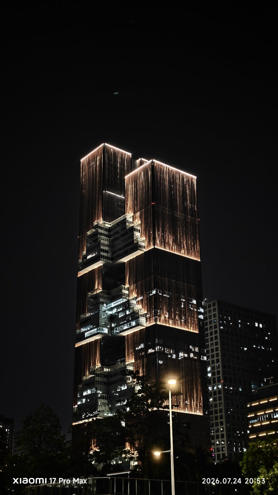
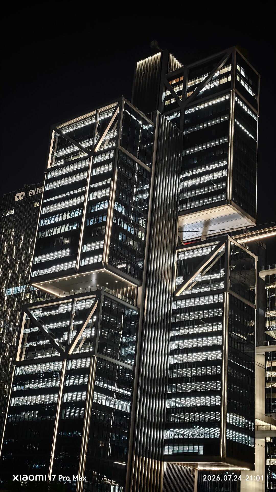
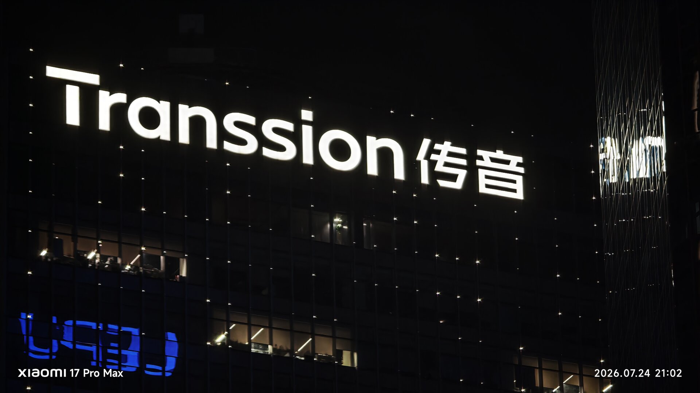
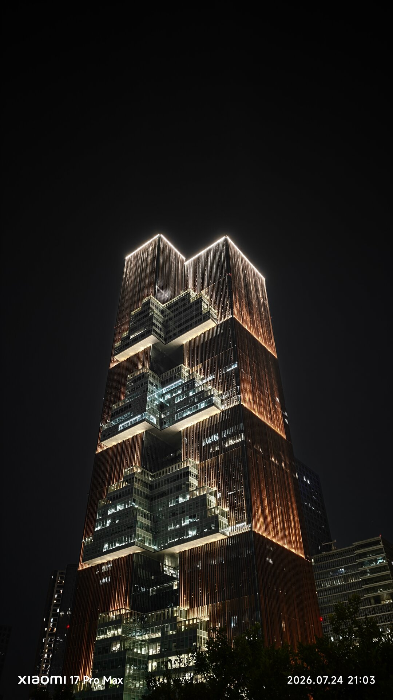
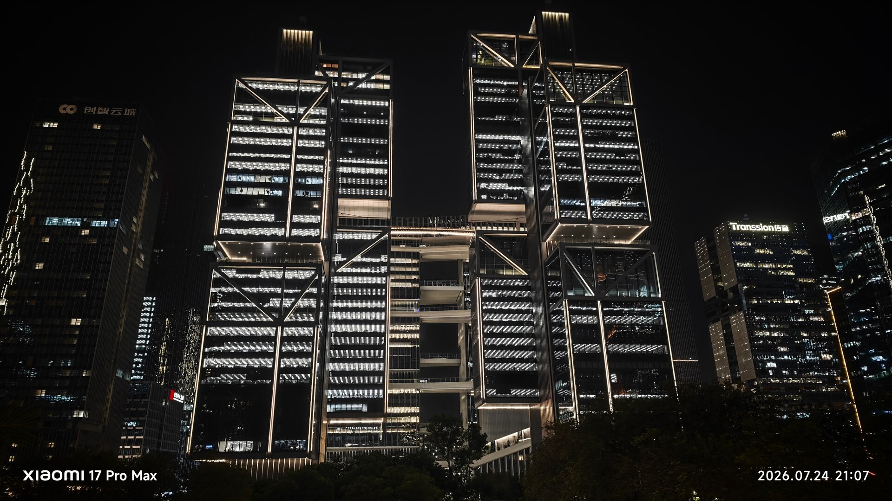
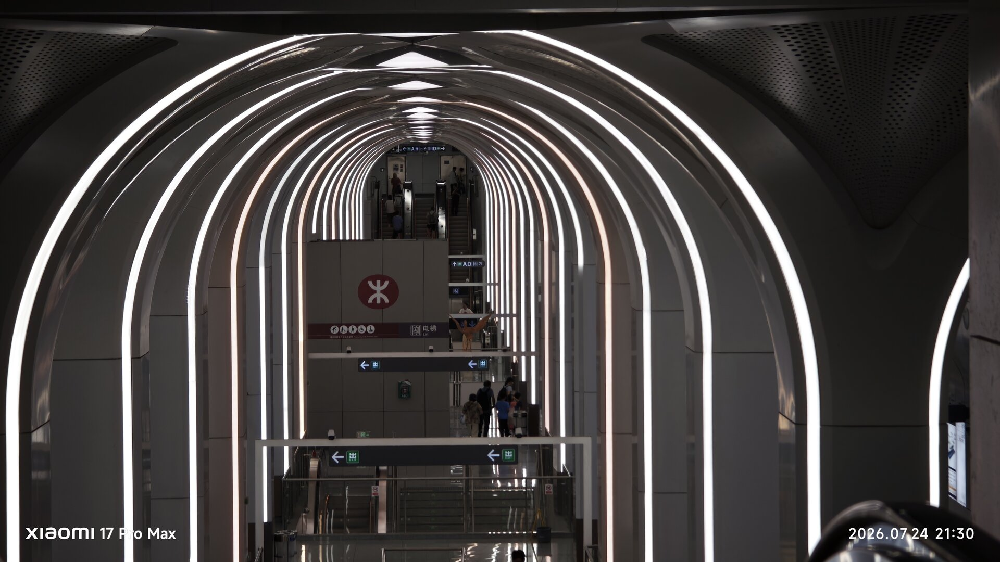

# 游仙洞的夜，灯火通明

以前听人说深圳加班很厉害，我一直只有一个模糊的印象。直到这次聚餐结束，大家在游仙洞附近散步，我抬头看见周围一栋栋仍然灯火通明的写字楼，才突然觉得这句话变得具体了。

原来夜已经这么深了，楼里还有那么多人没有下班。

## 看得见的“班味”

老板以前开导员工加班的时候，我还在想：深圳的加班真的有传闻中那么普遍吗？

那天晚上算是亲眼见识到了。

从楼下望上去，窗户被灯光切成一格一格。远处看起来很漂亮，建筑的线条和夜色放在一起，甚至有些适合拍照。但只要想到每一盏灯后面可能都坐着还没结束工作的人，景色就多了一层很浓的“班味”。

白天走在这里，大家都是人流里匆匆的一部分。到了晚上，路上的人少了一些，楼却没有暗下来。所谓一座城市的工作节奏，不一定要看统计数字，有时只要在晚上九点抬头看一眼，就已经能感受到大概。

## 燥热的空气

深圳的夜里依然很热。

高楼、道路和密集的灯光挤在一起，空气像是没有地方流动。也许是热岛效应，也可能只是那几天本来就闷热，总之走在楼下时，能感觉到一种挥之不去的燥。

这种闷热和周围没有熄灭的办公室放在一起，让人很难彻底忘掉工作。即使已经离开工位，环境还是在提醒你，这片区域依旧处在运转之中。

不过那天的心情反而是最近比较放松的一次。

聚餐已经结束，手头的事情暂时没有出岔子，大家也不必立刻回到电脑前。我们就在楼下走走，看看这些平时不会认真看的建筑。工作压力当然没有凭空消失，但至少在那一小段路上，可以把注意力从任务和进度里移开。

## 项目还在稳步推进

能放松下来，还有一个很现实的原因：自己着手开发的 Agent 项目没有出问题，仍在按计划稳步推进。

做项目时最让人不安的，往往不是工作量本身，而是不知道下一步会不会突然冒出意外。一个环节失控，就可能打乱后面全部安排。最近虽然依旧忙，但至少项目没有偏离预期，事情还在一件件往前走。

这种“没有出岔子”听起来不算什么值得庆祝的成果，可真正身处其中时，就知道稳定本身已经很难得。它意味着之前做的判断暂时经得住考验，也意味着今晚散步的时候，不需要一直想着回去补救什么。

所以即使空气燥热，周围的楼还亮得像是没有下班，我的心情也没有跟着一起紧绷。

## 在回去以前

散步快结束时，我们经过一条被灯带包围的通道。和外面的高楼相比，它显得更安静，重复的弧线一路向前，像是把喧闹短暂隔在了外面。

深圳的工作节奏大概不会因为一次聚餐或一次散步而改变。第二天醒来，项目还要继续，写字楼里的灯也可能再次亮到很晚。

但那天晚上，我第一次很具体地看见了游仙洞的“班味”，也在这种浓得化不开的工作氛围里，得到了一点难得的轻松。

项目稳稳地往前走，我也可以暂时慢一点。

这大概就是那个燥热夜晚里，最让人安心的事情。
